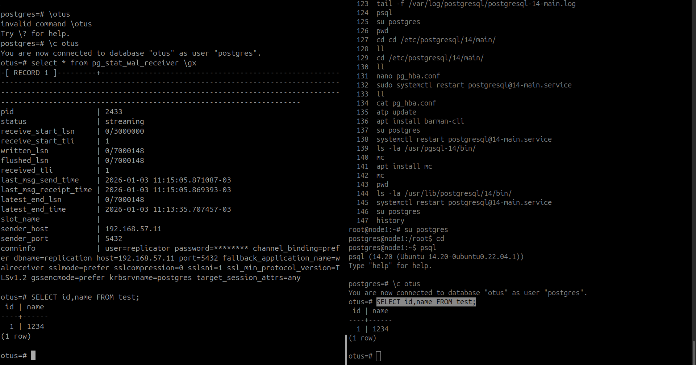

## Домашнее задание 46 PostgreSQL Replication & Backup  
#### Цель домашнего задания  
Научиться настраивать репликацию и создавать резервные копии в СУБД PostgreSQL  

#### Описание домашнего задания  
1. Настроить hot_standby репликацию с использованием слотов  
2. Настроить правильное резервное копирование  

## Настройка репликации  


## Настройка Barman Backup  
+ Установка утилиты  
```
vagrant@barman:~$ sudo -i
root@barman:~# apt update
...
root@barman:~# apt install -y barman-cli barman postgresql


```
+ Настройка утилиты  
```
barman@barman:/root$ cd
barman@barman:~$ pwd
/var/lib/barman
barman@barman:~$ ssh-keygen -t rsa -b 4096
Generating public/private rsa key pair.
Enter file in which to save the key (/var/lib/barman/.ssh/id_rsa): 
Created directory '/var/lib/barman/.ssh'.
Enter passphrase (empty for no passphrase): 
Enter same passphrase again: 
Your identification has been saved in /var/lib/barman/.ssh/id_rsa
Your public key has been saved in /var/lib/barman/.ssh/id_rsa.pub
The key fingerprint is:
SHA256:oTLtjB0G9NW5PMbAZume16pBCXXElFUAZgBDNPBHxxQ barman@barman
The key's randomart image is:
+---[RSA 4096]----+
|    o+*o=XE*oo.  |
|   . o **=*      |
|    . ++o+ .     |
|     o +.o*      |
|    o =.So o     |
|     O oo . .    |
|    . + .. .     |
|         ..      |
|        ..       |
+----[SHA256]-----+
barman@barman:~$ ls -la .ssh/
total 16
drwx------ 2 barman barman 4096 Jan  3 12:58 .
drwxr-x--- 3 barman barman 4096 Jan  3 12:58 ..
-rw------- 1 barman barman 3381 Jan  3 12:58 id_rsa
-rw-r--r-- 1 barman barman  739 Jan  3 12:58 id_rsa.pub
barman@barman:~$ nano /var/lib/barman/.ssh/authorized_keys
barman@barman:~$ cat .ssh/id_rsa.pub 
ssh-rsa AAAAB3NzaC1yc2EAAAADAQABAAACAQC++iRN7yfwXlwhch3PMTdG/NeenT/CYdxfeW1SyK+z0DA3nbYmGP70AUuAPEzjWSJcX2fDcynlVeszObVv163sbxe+i9vsti30A7b7U3HWQcXTwB2n3oN0tdS6FOp+rXi+9vwBbVmciBJa/D3XgCrRgcFvAPWYpHYfva8im4bu83vgeHaRj5uD/jpyB199YX6MICwaaGzIZ7rvzxpcAgiGyq5LBdMv2CSKKpG3d+VCK/DFGVZJh9gkbIocdO/QkUUw23ir9HqpeS5rsMKujin4ucUXc7+FK7cwWODKx+Q9kaksLmbvt0Ir3aSJt7DT7vYXn5zKw8I9T2cGSHQQElgx3RQAhZ9ZVEs131IW/Srd+Wn13z822+PBKX6C+nUIQAZohOUDA/IBB1VxdHCgwy6HVC/Qmk8pEzmvng/nUdwhd2AwRZsqzFMwcb4TSICxZxTl/4oU02IfvOS3tuIWz7i2E+XOP04tuNF4DOYxzrekHHyd/EYGY5P0EK9z+DUzw4r6z5At0xtBmSlF+a9fPBfHEKyuMo3HOV1DbBj7L34DG4zAVLTU8+0P4z4xdbCpU8x8tT/ANP/E7hp3DodATKAShyn/O++w/Z08/LxVkMt6tZKEwhq+AId4JSQVxfC0Ve4aHKgySUQbW1mV3nGFgd+VMECdzfS+1vXbS8kTnVeFWw== barman@barman
barman@barman:~$ 
barman@barman:~$ 
barman@barman:~$ nano ~/.pgpass
barman@barman:~$ ls -la !$
ls -la ~/.pgpass
-rw-rw-r-- 1 barman barman 38 Jan  3 13:22 /var/lib/barman/.pgpass
barman@barman:~$ chmod 600 !$
chmod 600 ~/.pgpass
barman@barman:~$ ls -la ~/.pgpass
-rw------- 1 barman barman 38 Jan  3 13:22 /var/lib/barman/.pgpass
barman@barman:~$ psql -h 192.168.57.11 -U barman -d postgres 
psql (14.20 (Ubuntu 14.20-0ubuntu0.22.04.1))
Type "help" for help.

postgres=> \l
                              List of databases
   Name    |  Owner   | Encoding | Collate |  Ctype  |   Access privileges   
-----------+----------+----------+---------+---------+-----------------------
 otus      | postgres | UTF8     | C.UTF-8 | C.UTF-8 | 
 postgres  | postgres | UTF8     | C.UTF-8 | C.UTF-8 | 
 template0 | postgres | UTF8     | C.UTF-8 | C.UTF-8 | =c/postgres          +
           |          |          |         |         | postgres=CTc/postgres
 template1 | postgres | UTF8     | C.UTF-8 | C.UTF-8 | =c/postgres          +
           |          |          |         |         | postgres=CTc/postgres
 test-46   | postgres | UTF8     | C.UTF-8 | C.UTF-8 | 
(5 rows)

postgres=> \q
barman@barman:~$ psql -h 192.168.57.11 -U barman -c "IDENTIFY_SYSTEM" replication=1
psql: error: connection to server at "192.168.57.11", port 5432 failed: FATAL:  no pg_hba.conf entry for replication connection from host "192.168.57.13", user "barman", no encryption
barman@barman:~$ psql -h 192.168.57.11 -U barman -c "IDENTIFY_SYSTEM" replication=1
      systemid       | timeline |  xlogpos  | dbname 
---------------------+----------+-----------+--------
 7590572975049464140 |        1 | 0/3058918 | 
(1 row)

barman@barman:~$ 

```
+ Создаём файл /etc/barman.conf  
```

```

+ Проверяем доступ barman to node1 server  
```
arman@barman:~$ barman check node1
Server node1:
	WAL archive: FAILED (please make sure WAL shipping is setup)
	PostgreSQL: OK
	superuser or standard user with backup privileges: OK
	PostgreSQL streaming: OK
	wal_level: OK
	replication slot: OK
	directories: OK
	retention policy settings: OK
	backup maximum age: OK (no last_backup_maximum_age provided)
	backup minimum size: OK (0 B)
	wal maximum age: OK (no last_wal_maximum_age provided)
	wal size: OK (0 B)
	compression settings: OK
	failed backups: OK (there are 0 failed backups)
	minimum redundancy requirements: OK (have 0 backups, expected at least 0)
	pg_basebackup: OK
	pg_basebackup compatible: OK
	pg_basebackup supports tablespaces mapping: OK
	systemid coherence: OK (no system Id stored on disk)
	pg_receivexlog: OK
	pg_receivexlog compatible: OK
	receive-wal running: OK
	archiver errors: OK
barman@barman:~$ barman switch-wal node1
The WAL file 000000010000000000000004 has been closed on server 'node1'
barman@barman:~$ barman switch-wal node1
The WAL file 000000010000000000000005 has been closed on server 'node1'
barman@barman:~$ 

```
+ Избавляемся от ошибки доступа  
```
barman@barman:~$ barman switch-wal --force --archive node1
The WAL file 000000010000000000000006 has been closed on server 'node1'
Waiting for the WAL file 000000010000000000000006 from server 'node1' (max: 30 seconds)
Processing xlog segments from streaming for node1
	000000010000000000000006
barman@barman:~$ barman check node1
Server node1:
	PostgreSQL: OK
	superuser or standard user with backup privileges: OK
	PostgreSQL streaming: OK
	wal_level: OK
	replication slot: OK
	directories: OK
	retention policy settings: OK
	backup maximum age: OK (no last_backup_maximum_age provided)
	backup minimum size: OK (0 B)
	wal maximum age: OK (no last_wal_maximum_age provided)
	wal size: OK (0 B)
	compression settings: OK
	failed backups: OK (there are 0 failed backups)
	minimum redundancy requirements: OK (have 0 backups, expected at least 0)
	pg_basebackup: OK
	pg_basebackup compatible: OK
	pg_basebackup supports tablespaces mapping: OK
	systemid coherence: OK (no system Id stored on disk)
	pg_receivexlog: OK
	pg_receivexlog compatible: OK
	receive-wal running: OK
	archiver errors: OK
barman@barman:~$ 

```  

### На этом настройка бекапа завершена.  

## ДЗ-46 выполнено  
